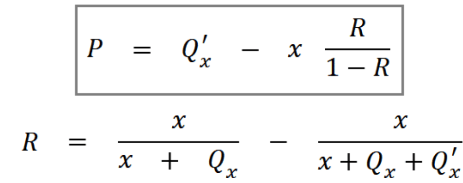

# PBJ

## How to measure it 

First step is to process al DEX (Decentralized Exchange) transactions. We processed all UniswapV2 and UniswapV3 from the Ethereum blockchain. 

We consider a transaction to be part of a sandwich attack if the following conditions are met: 

- Three consecutive transactions on the same token. 
- The first two are buy transactions and the last one is a sell transaction. 
- The first and the last one came from the same wallet. 
- The last transaction sells the same amount of tokens as the first transaction.
- The amount obtained in the sell operation is greater than the first buy operation. 

If all these conditions are met we can be confident we are treating with a sandwich attack. 

## Calculate profit

The variable meanings:

- P: Expected profit from the attacker perspective.
- Qx: Token quantity bought by the attacker.
- Q’x: Token quantity bought by the user.
- x: Token quantity available in the liquidity pool pair

1) The profit needs to be higher than the gas fee (fee that miners charge for processing each transaction). Because profits tend to be small, Q’x (amount of tokens acquired by the user) needs to be big in order to overcome gas fees. 

2) Relaxed slippage. Slippage is the maximum deviation from the desired price an user is willing to accept in a trade. Because transactions are not executed immediately, other transactions operating within the same token may be executed first, resulting in price variation. This means users wanting to buy a token cannot know the exact price at the time their transactions will execute. This poses the problem of buying tokens that may have experienced a substantial price variation.

3) To protect users from buying a token at an undesired price, it is possible to define a slippage for each transaction. For most cases, the slippage is set to 2%. The higher the slippage, the more subjective transactions are to frontrunning attacks. 

## Notes

- Transactions in a sandwich attack are typically sent to a proxy contract instead of a router offered by the exchange. This allows attackers to check whether the respective liquidity pools still hold the expected amount of tokens before executing the swap. If this is not the case and an attack would not be profitable, the swap can easily be canceled.

-  (as of 2021) 964 different proxy contracts that received at least one attack transaction. Attackers appear to switch their proxies frequently, as a contract is only in use for two weeks on average (90’913 blocks). The most active proxy contract processed 51’475 of the attack transactions we discovered (5.36%).